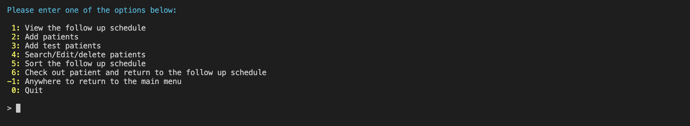

<h1 align="center" > 🗓 Follow Up Schedule</h3>

<p align="center"> 

This application is designed for managing patient follow-up appointments.

</p>

<!-- This is a test -->

## Table of Contents

- [Table of Contents](#table-of-contents)
- [About](#about)
- [Getting Started](#getting-started)
  - [Prerequisites](#prerequisites)
  - [Running the script](#running-the-script)
- [Application instructions](#application-instructions)
  - [Option 1: View the follow up schedule.](#option-1-view-the-follow-up-schedule)
  - [Option 2: Add patients.](#option-2-add-patients)
  - [Option 3: Add test patients.](#option-3-add-test-patients)
  - [Option 4: Search/Edit/delete patients.](#option-4-searcheditdelete-patients)
  - [Option 5: Sort.](#option-5-sort)
  - [Option 6: Check out and return to the follow up schedule.](#option-6-check-out-and-return-to-the-follow-up-schedule)
  - [Option 7: Return to the main menu anywhere in the program.](#option-7-return-to-the-main-menu-anywhere-in-the-program)
  - [Option 8: Quit the program from the main menu.](#option-8-quit-the-program-from-the-main-menu)
- [Built Using](#built-using)
- [Author](#author)
- [License MIT](#license-mit)

## About

This application will help dentists put their patients on a regular follow-up schedule according to each patient’s need. For example, some patients may need regular six months follow-ups to be scheduled, others may need shorter or longer follow-ups. On the other hand, some patients may prefer to call and schedule as needed, so won’t be placed on a regular follow-up schedule. Once a patient is placed on the follow-up schedule, the application will calculate the next follow-up date according to the follow-up frequency chosen and the last visit date. Each time the patient attends their follow-up visit, they can be checked out and returned to the follow-up schedule with the next follow-up date being calculated automatically.

## Getting Started

The following instructions will guide you on how to run this python script.

### Prerequisites

Python 3 is needed to run this project.

If you don't have python installed on your computer, follow this link to install python on your computer [python](https://www.python.org).

You can check if you have python 3 installed by running the following command on the terminal (MacOS) or command prompt (Windows)

```
python --version
```
Example output:

```
Python 3.9.9
```

### Running the script

- Download the project folder [Follow-Up-Schedule](https://github.com/drmohammadatieh/Follow-Up-Schedule/archive/refs/heads/master.zip)

- Open the terminal on MacOS or the command prompt on Windows 7/10.
- Go to the directory that contains the project files. Example:
  
  In MacOS:
  
  ```
  cd  Downloads/Follow-Up-Schedule-master/
  ```
  In Windows:

   ```
  cd  Downloads\Follow-Up-Schedule-master\
  ```
- Run the script by typing the following command

  ```
  python main.py
  ```

Main screen will look like this:

<!-- 
{: height ="36px" width ="36px"} -->


## Application instructions

This program has a user-friendly CLI interface as seen above. To navigate through the application, you just need to type in the selection number, then hit enter key. The main screen is shown above. You have different options to select from.

### Option 1: View the follow up schedule.
  
  The menu options will reappear again below the schedule to help you navigate to the other application sections.
  

### Option 2: Add patients.
  
  Each field will appear one at a time to allow you to type in the information. The first letter of each part of the name will be capitalized automatically when the information is saved, so you don't have to worry about that. You have to hit enter after each entry is complete. 
  
  The complete information entry will look like that. Then you have to answer "y" and hit enter again to save.
  
  A a verification will be received after the information is saved successfully.
  
  
### Option 3: Add test patients.
  
  This option is designed for trying the application by the user and testing purposes. It adds six fake patients to the followup schedule.
  

### Option 4: Search/Edit/delete patients.

  This option will allow you to search for a patient using first and/or last name using partial or complete keywords.
   
  Here is an example of the search method using part of the first and last names. You have to hit enter to star the search process:
   
  This screen shows the result:
   
  After the search is complete, you can go to the edit or delete mode if needed.
  
  If you select the edit mode, you can then enter the file number for the record you want to edit then hit enter. The file number should be from the file numbers appeared in the search step. In the following example, there is only one file number to select from:
  
  Then you can edit one field at a time.
  
  The same process applies for the delete mode. You do the search first then enter the delete mode:
  
  Then you can select one or more file numbers separated by commas for the records you want to delete:
  

### Option 5: Sort.
  This option allow you to sort the follow up schedule according to different keys (columns). You can use the letter "a" or "d" after the column number to specify the sort order (ascending/descending):
  
  The most useful example is sorting by the next follow up visit date with/without priority as shown here:
  
  Here is the result:
  

### Option 6: Check out and return to the follow up schedule.
  After the patient attends his appointment, it is very helpful to check the patient out and return to the follow up schedule. This can be done by searching the patient, then typing the file number and hitting enter.
  
  Here it shows how the next follow up date is calculated and reflected on the follow up schedule automatically:
  

### Option 7: Return to the main menu anywhere in the program.
  To return to the main screen, you just need to type -1 followed by enter anywhere in the application.
  

### Option 8: Quit the program from the main menu.
  To quit the application completely, you just need to return to the main menu then type 0 followed by enter key.
  
   
## Built Using

- [Python 3.9](https://www.python.org) - Interpreted programming language.

## Author

- [@drmohammadatieh](https://github.com/kylelobo) - Idea & Implementation.
  
## License [MIT](https://github.com/drmohammadatieh/Follow-Up-Schedule/blob/master/LICENSE)


